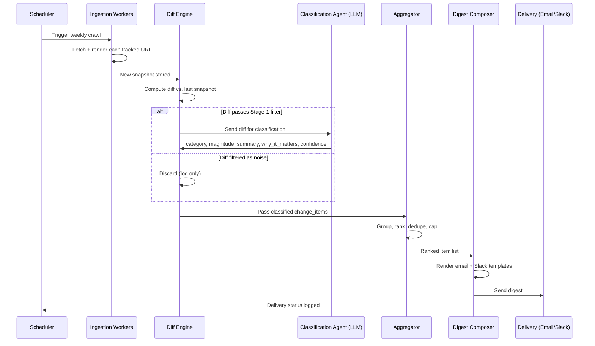

# Competitive Intelligence Agent
### PRD · TRD · Design Document
**Version:** 1.0 · **Status:** Draft · **Owner:** [Your Name] · **Last updated:** 2026-09-25

---

# Part 1 — Product Requirements Document (PRD)

## 1.1 Problem Statement

Product, sales, and pricing teams need to know what competitors are doing — but today this is either:
- **Manual and inconsistent**: someone checks a spreadsheet of competitor URLs "when they remember to," usually monthly or after losing a deal.
- **Reactive**: teams find out about a competitor's price cut or new feature from a lost sales call, not before it happens.
- **Noisy when tooling exists**: generic "web change monitoring" tools (Visualping, Distill) flag *every* pixel change — a rotated hero banner is treated the same as a price change — so teams tune out the alerts.

There is no cheap, low-maintenance system that watches competitors continuously, filters signal from noise, and explains **why a change matters**, not just that something changed.

## 1.2 Goals

| Goal | Metric | Target |
|---|---|---|
| Save analyst time currently spent on manual competitor checks | Hours/week saved per user | ≥ 3 hrs/week |
| Surface material changes faster than status quo | Time from change occurring → team notified | < 7 days (vs. weeks/never today) |
| Keep signal-to-noise high enough that people keep reading | Weekly digest open rate | > 60% after week 4 |
| Reduce "we didn't know they launched X" incidents | Self-reported surprises in QBRs | Trend to zero over 2 quarters |

## 1.3 Non-Goals (v1)

- Not a real-time alerting system (Slack pings for every change) — v1 is a **weekly digest**, with an optional "urgent change" fast-path for pricing moves only.
- Not a general-purpose web scraper / monitoring platform for arbitrary sites.
- Not a market-research or sentiment-analysis tool (no social listening, no review mining in v1).
- Not a legal/compliance tool — it does not make claims about competitor financials or non-public information.

## 1.4 Target Users

**Primary persona — "Priya, Product Marketing Manager"**
Tracks 5–10 named competitors. Needs to update battlecards and brief sales. Currently spends ~4 hrs/week manually checking pricing pages and LinkedIn.

**Secondary persona — "Dan, Head of Sales"**
Doesn't want to read anything long. Wants a 5-bullet Monday-morning summary of "what changed and does it affect us."

**Secondary persona — "Alex, VP Product"**
Cares about job postings and product-page language as a leading indicator of competitor roadmap and hiring priorities (e.g., "Competitor X is hiring 3 ML engineers — likely building an AI feature").

## 1.5 User Stories

1. As Priya, I want to add a competitor by name/domain and have the agent auto-discover their pricing page, key product pages, and careers page, so I don't have to hand-configure URLs.
2. As Priya, I want a weekly digest email/Slack post summarizing what changed across all tracked competitors, grouped by competitor and by category (pricing, product, hiring).
3. As Priya, I want each change item to include *why it matters* (a one-line "so what"), not just a diff.
4. As Dan, I want pricing changes to trigger a same-day notification instead of waiting for the weekly digest.
5. As Alex, I want job-posting trends surfaced (e.g., "+40% postings mentioning 'LLM' in last 30 days") rather than a raw list of job titles.
6. As an admin, I want to mark items "not relevant" so the agent learns to deprioritize similar future changes.
7. As Priya, I want to click into any digest item and see the before/after evidence (screenshot or text diff) so I can trust the summary.
8. As an admin, I want to exclude certain URLs/sections (e.g., a blog with 50 posts/week) from monitoring so they don't dominate the digest.

## 1.6 Functional Requirements

### Must-have (v1)
- FR1: Add/remove/edit tracked competitors (name, domain, optional manual URL list).
- FR2: Auto-discover key page types per competitor: pricing, product/features, careers/jobs.
- FR3: Periodic crawl (default weekly, configurable to daily for pricing) of tracked pages.
- FR4: Change detection with noise filtering (ignore cosmetic/layout-only changes).
- FR5: LLM-generated classification of each change: category (pricing / product / hiring / messaging / other), magnitude (minor/major), and a 1–2 sentence "why it matters."
- FR6: Weekly digest generated and delivered via email and/or Slack, grouped by competitor.
- FR7: "Urgent" fast-path: pricing changes trigger notification within 24 hours, independent of the weekly cycle.
- FR8: Evidence view — each digest item links to the underlying diff/screenshot.
- FR9: Feedback loop — thumbs up/down or "not relevant" on digest items, stored and used to adjust future filtering.

### Should-have (v1.x)
- FR10: Configurable digest cadence per team (weekly default; daily/biweekly options).
- FR11: Include/exclude URL patterns per competitor.
- FR12: Basic dashboard showing change history per competitor over time.

### Could-have (later)
- FR13: Slack slash-command to query "what's changed with [competitor] recently?" on demand.
- FR14: Integration with CRM (e.g., auto-attach latest battlecard update to opportunities involving that competitor).
- FR15: Multi-language competitor sites (translation before diffing).

## 1.7 Non-Functional Requirements

- **Reliability**: A single competitor's page failing to load must not block digest generation for others; failures degrade gracefully and are reported, not silently dropped.
- **Legality/Ethics**: Only crawl publicly accessible pages; respect `robots.txt` and site Terms of Service; no login-walled or paywalled scraping; no circumventing anti-bot measures (see §2.7 for detail).
- **Latency**: Weekly digest must be generated and delivered by a fixed time (e.g., Monday 8am local) with >99% on-time delivery.
- **Cost**: LLM + infra cost per tracked competitor should stay low enough to support 20–50 competitors on a small team budget (target: < $2/competitor/week in LLM spend at v1 scale).
- **Auditability**: Every digest claim must be traceable to a stored raw snapshot/diff.

## 1.8 Risks & Assumptions

| Risk | Mitigation |
|---|---|
| Competitor sites use heavy JS rendering / anti-bot protection | Use headless browser rendering; fall back to "manual check needed" flag rather than guessing |
| False positives (cosmetic changes flagged as material) | Two-stage filter: cheap structural diff first, LLM classification only on candidates; feedback loop to tune thresholds |
| Legal/ToS concerns about scraping | Restrict to public pages, respect robots.txt, add configurable per-domain opt-out, legal review before GA |
| LLM hallucinating "why it matters" | Ground every classification in the actual diff text passed to the model; never let the model invent facts not present in the scraped content |
| Digest fatigue (too much content) | Hard cap on items per digest (e.g., top 15), with lower-priority items in a "minor changes" collapsed section |

## 1.9 Success Criteria for Launch (v1 GA)

- 3 pilot teams using it for 4+ consecutive weeks.
- Digest open rate > 50% by week 4.
- < 10% of digest items marked "not relevant" by week 6 (signal that filtering is working).
- Zero legal/ToS complaints from monitored sites during pilot.

---

# Part 2 — Technical Requirements Document (TRD)

## 2.1 System Overview

The system is a **scheduled multi-agent pipeline**, not a single conversational agent. It runs on a cadence (not purely event-driven), with one fast-path exception for pricing urgency.

```
[Competitor Registry] 
        │
        ▼
[Discovery Agent] ──> finds/updates candidate URLs (pricing, product, careers)
        │
        ▼
[Ingestion Workers] ──> fetch & render pages, store raw snapshots
        │
        ▼
[Diff Engine] ──> structural diff vs. last snapshot, filters noise
        │
        ▼
[Classification Agent] ──> LLM: categorize + assess magnitude + "why it matters"
        │
        ▼
[Aggregation & Ranking] ──> dedupes, ranks, groups by competitor/category
        │
        ▼
[Digest Composer] ──> renders email/Slack digest
        │
        ▼
[Delivery] ──> email / Slack / dashboard
```

A separate lightweight loop handles the **pricing fast-path**: pricing-page diffs bypass the weekly batch and go straight to classification → delivery within 24h.

## 2.2 Components

### 2.2.1 Competitor Registry (data store)
Stores tracked competitors and their known/candidate URLs, crawl cadence, and exclusion rules.

```
Competitor {
  id, name, domain, status (active/paused),
  urls: [{ url, page_type, discovered_by (manual|auto), last_crawled_at }],
  exclude_patterns: [string],
  crawl_cadence: { default: "weekly", pricing: "daily" },
  created_at, updated_at
}
```

### 2.2.2 Discovery Agent
- Input: competitor domain.
- Uses sitemap.xml + a small set of heuristic path guesses (`/pricing`, `/plans`, `/careers`, `/jobs`) + a search-engine query ("site:domain.com pricing") to find candidate pages.
- An LLM call classifies discovered pages by type (pricing / product / careers / other) using page title, URL, and first N tokens of content.
- Re-runs periodically (e.g., monthly) to catch new pages (new product line, new careers subsite).
- Human-in-the-loop: newly discovered URLs are queued for a quick admin confirmation before being added to active tracking, to avoid drift.

### 2.2.3 Ingestion Workers
- Headless browser (Playwright) fetches each tracked URL on its configured cadence.
- Renders JS, waits for network idle, extracts:
  - Full rendered text content (cleaned of nav/footer boilerplate via a content-extraction heuristic, e.g., readability-style algorithm).
  - A visual screenshot (for evidence view).
  - Structured extraction for pricing pages specifically: attempt to parse plan names, prices, billing periods into a structured table using an LLM extraction pass (schema-constrained JSON output), in addition to raw text.
- Stores a timestamped snapshot (raw HTML optional, cleaned text + screenshot required) in blob storage; metadata in the database.
- Respects `robots.txt` at fetch time (cached, re-checked periodically); skips and logs disallowed pages.
- Rate-limited and randomized fetch timing per domain to avoid hammering competitor infrastructure.

### 2.2.4 Diff Engine
Two-stage filtering to control LLM cost and noise:

**Stage 1 — Structural/textual diff (cheap, deterministic)**
- Token-level diff (e.g., `difflib` / Myers diff) between cleaned text of current vs. previous snapshot.
- Discard if change is below a minimum threshold (e.g., < 5 changed tokens, or changed tokens are only in known boilerplate regions like copyright year, cookie banners).
- For pricing pages, diff the *structured* extraction (plan/price table) directly — a changed number is never filtered as noise regardless of token count.

**Stage 2 — Candidate changes only → passed to Classification Agent**
- Only diffs surviving Stage 1 incur an LLM call, keeping cost proportional to actual change volume, not crawl volume.

### 2.2.5 Classification Agent (LLM)
- Input: page type, competitor name, before/after text (or structured diff for pricing), URL.
- Output (schema-constrained JSON):
```json
{
  "category": "pricing | product | hiring | messaging | other",
  "magnitude": "minor | major",
  "summary": "one sentence describing what changed",
  "why_it_matters": "one to two sentences of business implication",
  "confidence": 0.0-1.0
}
```
- Strict grounding rule in the system prompt: the model may only reference facts present in the provided diff; it must not speculate about unstated intent (e.g., don't assert "they're pivoting to enterprise" unless the page text supports it) — confidence score is lowered instead of asserting.
- Low-confidence or ambiguous classifications are flagged for human review rather than shown to end users.

### 2.2.6 Job-Postings Analyzer (specialized sub-pipeline)
- Careers pages often list many postings; treating each new posting as a "change" would flood the digest.
- Instead: weekly aggregate stats — new postings count, postings by function/team (LLM-tagged), keyword trend detection (e.g., % of postings mentioning "LLM," "agent," "enterprise," "SOC 2") vs. prior 4-week baseline.
- Only statistically notable shifts (configurable threshold, e.g., >25% change) generate a digest item; the underlying full list is available in the evidence view.

### 2.2.7 Aggregation & Ranking
- Groups classified items by competitor, then by category.
- Ranks by magnitude (major first) and confidence.
- Deduplicates near-identical items across crawl runs (e.g., a change first detected mid-week doesn't reappear as "new" in the next digest).
- Applies a hard cap (e.g., top 15 items expanded, remainder collapsed into a "minor changes" list) to control digest length.

### 2.2.8 Digest Composer
- Renders a templated weekly digest (HTML email + Slack Block Kit variant) from the ranked item list.
- Each item: competitor name, category tag, one-line summary, "why it matters," confidence indicator, link to evidence view.
- Includes a short top-of-digest "highlights" section (top 3–5 items across all competitors) for skimmers like the Dan persona.

### 2.2.9 Feedback Loop
- "Not relevant" / thumbs-down on a digest item stores a labeled example (competitor, category, diff text, label).
- Weekly batch job reviews feedback and adjusts: (a) Stage-1 noise thresholds per domain/page-type, (b) few-shot examples injected into the Classification Agent prompt, (c) optionally fine-tunes a lightweight classifier for Stage 1 pre-filtering over time.

## 2.3 Data Model (core tables)

```
competitors(id, name, domain, status, crawl_cadence, created_at)
tracked_urls(id, competitor_id, url, page_type, exclude, last_crawled_at)
snapshots(id, tracked_url_id, fetched_at, text_content_blob_ref, screenshot_blob_ref, structured_data JSON)
diffs(id, tracked_url_id, snapshot_before_id, snapshot_after_id, stage1_score, passed_filter BOOLEAN)
change_items(id, diff_id, category, magnitude, summary, why_it_matters, confidence, status[pending|shown|dismissed])
digests(id, period_start, period_end, sent_at, channel)
digest_items(id, digest_id, change_item_id, rank)
feedback(id, change_item_id, user_id, label[relevant|not_relevant], created_at)
```

## 2.4 Orchestration & Scheduling

- Weekly batch pipeline runs on a scheduler (e.g., cron / Temporal / Airflow-style DAG):
  `discover (monthly) → crawl (per cadence) → diff → classify → aggregate → compose → deliver`
- Pricing fast-path is a separate daily job: `crawl pricing pages → diff (structured) → classify (if changed) → deliver urgent notification`.
- Recommend a durable workflow engine (e.g., Temporal, or a simpler queue + worker model with retries) rather than a single long-running script, so a failure on competitor #7 of 30 doesn't abort the whole run.

## 2.5 Tech Stack (suggested)

| Layer | Choice | Why |
|---|---|---|
| Headless browser | Playwright | Handles JS-heavy sites, screenshots, reliable waits |
| Backend/orchestration | Python (FastAPI) + Temporal or Celery | Mature scraping/async ecosystem, durable workflows |
| LLM | Claude (Sonnet-class for classification, cheaper/faster model acceptable for Stage-1-adjacent tagging if needed) | Structured JSON output, strong grounding/instruction-following |
| Database | PostgreSQL | Relational integrity for competitors/URLs/items; JSON columns for structured extraction |
| Blob storage | S3-compatible | Snapshots, screenshots |
| Delivery | SendGrid/SES (email), Slack Bolt SDK (Slack) | Standard, reliable |
| Scheduler | Temporal / cron + queue workers | Retries, visibility into failures |
| Search/discovery | Sitemap parsing + lightweight search API (e.g., Bing/Google Custom Search) | For discovery agent |

## 2.6 Cost & Performance Considerations

- Stage-1 filtering is the primary cost control — most crawls produce no material change; only real diffs hit the LLM.
- Batch classification calls where possible (multiple small diffs from the same competitor in one prompt) to reduce per-call overhead.
- Cache rendered pages' boilerplate regions (nav/footer) per domain so extraction doesn't need to re-identify them every crawl.
- Target: for 30 competitors × ~5 pages each × weekly crawl, expect single-digit LLM calls per competitor per week after Stage-1 filtering (most pages don't change materially week to week).

## 2.7 Legal, Ethical & Compliance Requirements

- Crawl only publicly accessible pages; no authentication bypass, no CAPTCHA solving/circumvention.
- Honor `robots.txt` disallow rules per domain.
- Configurable per-domain rate limiting (default: no more than 1 request per few seconds to a given domain) to avoid burdening competitor infrastructure.
- Maintain a per-domain opt-out/exclude list; if a competitor requests removal, provide a documented process to honor it.
- Do not scrape or store personal data about named individuals beyond what's already public in a job posting's role/team info (no scraping of, e.g., employee LinkedIn profiles).
- Legal review recommended before GA rollout, especially regarding ToS of specific high-value competitor domains.

## 2.8 Monitoring & Observability

- Per-domain crawl success/failure rate; alert if a domain fails 3 consecutive crawls (likely blocked or page structure changed).
- LLM classification confidence distribution over time (drift detection).
- Digest delivery success/failure and open-rate tracking.
- Cost dashboard: LLM spend per competitor per week.

---

# Part 3 — Design Document

## 3.1 Agent Workflow (step-by-step, weekly cycle)

1. **Trigger**: Scheduler fires Monday 2am local (ahead of 8am delivery).
2. **Discovery refresh** (monthly, not every run): Discovery Agent checks each active competitor for new candidate pages; new finds go to an admin approval queue, not directly into tracking.
3. **Crawl**: Ingestion Workers fetch all `tracked_urls` due for crawl per their cadence; store snapshot; on failure, retry twice with backoff, then mark `crawl_failed` and continue with other URLs.
4. **Diff (Stage 1)**: For each URL with a prior snapshot, compute structural diff; tag `passed_filter = true/false`.
5. **Classify (Stage 2)**: For diffs with `passed_filter = true`, call Classification Agent; store `change_items`.
6. **Aggregate**: Group by competitor → category; rank by magnitude/confidence; cap total items; overflow into "minor changes."
7. **Compose**: Render digest (email HTML + Slack blocks) from ranked `change_items`.
8. **Deliver**: Send via configured channels; log delivery status.
9. **Feedback collection**: Digest items carry inline 👍/👎 or a "not relevant" link back to the system; feedback stored for the weekly tuning job.

**Pricing fast-path (daily, parallel process)**
1. Crawl pricing pages only.
2. Structured diff on parsed plan/price table (bypasses Stage-1 text-noise filter — any structured price delta always classifies).
3. If changed: classify → send "Pricing Alert" notification (Slack DM/channel + email) within the same day, independent of the weekly digest. The item is also included in that week's digest for completeness, marked "previously alerted."

## 3.2 Sequence Diagram — Weekly Digest Generation



## 3.3 Digest Output Format (example)

**Subject: Competitive Digest — Week of Sept 21–27**

```
🔴 URGENT (sent earlier this week)
• Acme Corp cut Pro plan pricing from $49→$39/mo. Likely response to our Q3 promo — 
  consider matching or reinforcing value story with sales. [View evidence]

TOP CHANGES THIS WEEK
━━━━━━━━━━━━━━━━━━━━━━
🏷 PRICING
• [none new beyond the urgent alert above]

🚀 PRODUCT
• Beta Inc added "AI Summarize" to their Team plan (previously Enterprise-only).
  Why it matters: removes a key differentiator we've used in sales — update battlecard.
  [View evidence]

👥 HIRING
• Gamma Co postings mentioning "LLM"/"agent" up 60% vs. last month (7 of 12 new postings).
  Why it matters: likely building AI features — worth monitoring product pages weekly instead of monthly.
  [View evidence]

MINOR CHANGES (12) — collapsed, click to expand
```

Each bullet links to an **evidence page**: side-by-side before/after screenshot + highlighted text diff + raw classification metadata (confidence score, timestamp).

## 3.4 Failure Modes & Fallback Design

| Failure | Design response |
|---|---|
| Page requires login / hits anti-bot wall | Mark URL `crawl_blocked`; surface in admin dashboard as "needs manual check"; never attempt to bypass |
| Page structure changes, extraction breaks | Structured extraction confidence check — if pricing table extraction confidence is low, fall back to raw-text diff and flag for human review rather than reporting a possibly-wrong price |
| LLM classification fails/times out | Retry once; on repeated failure, include the raw diff in digest under "unclassified changes needing review" rather than dropping it silently |
| Competitor blocks the crawler's IP/UA | Respect it — do not rotate proxies to evade; flag domain as `crawl_blocked`, notify admin, suggest manual monitoring |
| Digest generation runs long / partial data | Deliver on schedule with whatever data is ready; missing competitors noted at the bottom ("X, Y not yet processed, will appear next week") rather than delaying the whole digest |

## 3.5 Extensibility (Future)

- **On-demand queries**: Slack slash-command `/competitor-intel acme` → ad hoc summary of recent Acme changes, using the same `change_items` store.
- **Trend view**: dashboard chart of pricing history, hiring velocity per competitor over time.
- **CRM integration**: auto-tag Salesforce/HubSpot opportunities with relevant recent competitor changes.
- **Configurable classification taxonomy**: let teams add custom categories (e.g., "partnerships," "compliance certifications") beyond the v1 default four.
- **Multi-language support**: translate before diff/classify for non-English competitor sites.

## 3.6 Open Questions for Team Discussion

1. Should the pricing fast-path notify all digest subscribers, or only a "pricing-sensitive" subset (e.g., sales leadership)?
2. What's the right default cap on digest items before it feels overwhelming — is 15 right, or should it scale with number of tracked competitors?
3. Do we need per-user digest customization (e.g., Alex only wants hiring signals) in v1, or is one digest per team sufficient initially?
4. Where does the discovery-agent human-approval step live — should it be a lightweight weekly email itself, or a dashboard task list?

---

*End of document.*
